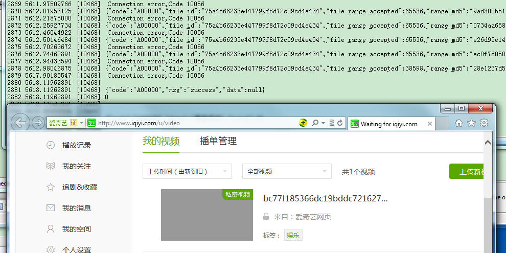

## c++模拟爱奇艺web视频上传

##### 说明
此次学习的是HTTP的post协议，使用使用multipart form-data上传文件。


##### 理解HTTP消息头 （五）——使用multipart/form-data上传文件

写的比较好的一篇帖子
https://www.cnblogs.com/liqiu/archive/2013/05/24/3096378.html

##### HTTP1.1封装
简单封装了HTTP1.1的get和post，实现http的长连接模式，实现发送和数据接收。简单实现了socket的复用。

##### Get封装
```c++
bool HttpConnect::getData1_1(std::string host, std::string path, std::string get_content)
{
	//GET请求方式
	std::stringstream stream;
	stream << "GET " << path << "?" << get_content;
	stream << " HTTP/1.1\r\n";
	stream << "Accept: */*\r\n";
	stream << "Host: " << host << "\r\n";
	stream << "User-Agent: Mozilla/5.0 (Windows; U; Windows NT 5.1; zh-CN; rv:1.9.2.3) Gecko/20100401 Firefox/3.6.3\r\n";
	stream << "Connection: Keep-Alive\r\n\r\n";
	return socketHttp(host, stream.str());
}
```

#### post封装
```c++
void HttpConnect::postData(std::string host, std::string path, std::string post_content)
{
	//POST请求方式
	std::stringstream stream;
	stream << "POST " << path;
	stream << " HTTP/1.1\r\n";
	stream << "Host: " << host << "\r\n";
	stream << "User-Agent: Mozilla/5.0 (Windows; U; Windows NT 5.1; zh-CN; rv:1.9.2.3) Gecko/20100401 Firefox/3.6.3\r\n";
	stream << "Content-Type: application/x-www-form-urlencoded\r\n";
	stream << "Content-Length: " << post_content.length() << "\r\n\r\n";
	stream << post_content.c_str();
	socketHttp(host, stream.str());
}
```

##### C++ 模拟POST，multipart/form-data格式上传

```c++
	long nFileSize = 0;
	char * pFileBuf = ReadFileBuf(g_strfile.c_str(),&nFileSize);
	g_filesize = nFileSize;

	int nCount = g_filesize/65536;
	int nLeave = g_filesize%65536;

	for(int i =0;i< nCount+1;i++)
	{
		__int64 dwTime = GetSysTimeMicros()/1000;

		std::string strBoundary = GetRamdomBoundary();

		std::string strConBoundary = "--" + strBoundary;

		std::stringstream  contentStram;
		contentStram << strConBoundary  << "\r\n";
		contentStram << "Content-Disposition: form-data; name=\"file_id\"\r\n\r\n";
		contentStram << g_file_id << "\r\n";

		contentStram << strConBoundary << "\r\n";
		contentStram << "Content-Disposition: form-data; name=\"file_size\"\r\n\r\n";
		contentStram << g_filesize << "\r\n";

		contentStram << strConBoundary << "\r\n";
		contentStram << "Content-Disposition: form-data; name=\"range\"\r\n\r\n";

		int nStart = 0;
		nStart = i* 65536;
		int nLast = 0;
		int nSendSize = 0;
		if (i != nCount)
		{
			nLast = nStart + 65535;
			nSendSize = 65536;
		}
		else
		{
			if (nLeave == 0)
				break;
			nLast = nStart + nLeave - 1;
			nSendSize = nLeave;
		}
		
		//contentStram << "0-65535" << "\r\n";
		contentStram << nStart << "-" << nLast << "\r\n";

		contentStram << strConBoundary << "\r\n";
		contentStram << "Content-Disposition: form-data; name=\"file\"; filename=\"blob\"\r\n";
		//contentStram << "Content-Type: application/octet-stream\r\n\r\n";
		contentStram << "Content-Type: video/mp4\r\n\r\n";

		std::string strContentData = contentStram.str();
		strContentData.append(pFileBuf+nStart,nSendSize);
		strContentData.append("\r\n");
		strContentData.append(strConBoundary);
		strContentData.append("--\r\n\r\n");
		int nContentLen = strContentData.size();


		//////////////////////////////////////////////////////////////
		std::stringstream streamPost;
		streamPost << "POST /upload?t=" << dwTime << " HTTP/1.1\r\n";
		streamPost << "Accept: */*\r\n";
		streamPost << "Content-Type: multipart/form-data; boundary="<<strBoundary<<"\r\n";
		streamPost << "User-Agent: Mozilla/5.0 (compatible; MSIE 10.0; Windows NT 6.1; WOW64; Trident/6.0)\r\n";
		streamPost << "Host: "<< host << "\r\n";
		streamPost << "DNT: 1\r\n";
		streamPost << "Connection: keep-alive\r\n";
		streamPost << "Cache-Control: no-cache\r\n";
		streamPost << g_cookie << "\r\n";
		streamPost << "Content-Length: " << nContentLen << "\r\n\r\n";

		std::string PostContent = streamPost.str();
		int nHeadSize = PostContent.size();
		PostContent.append(strContentData.c_str(),nContentLen);
		int nPostSize = PostContent.size();
		if (http.socketHttp(host,PostContent) == false)
		{
			AfxMessageBox(_T("发包失败！"));
			break;
		}
		else
		{
			std::string strGetResult = http.GetLastRequestResult();

			std::wstring wStr;
			Transcode::UTF8_to_Unicode(strGetResult.c_str(), strGetResult.size(), wStr);
			const wchar_t* pData = wStr.c_str();
			OutputDebugString(pData);
		}
	}
```


##### 爱奇艺web上传需要参数

1、cookie  = Cookie: P00004=.1543915259.61731a407d; QC173=0; QC001=1; QC006=12e....

2、access_token  =  2.xxx

这两个数值都可以抓包获取，请手动更新

##### 测试截图

上传log显示




##### 遗留问题
视频上传成功，但是无法过爱奇艺的后台检测。不是这次学习的重点，未做研究！

